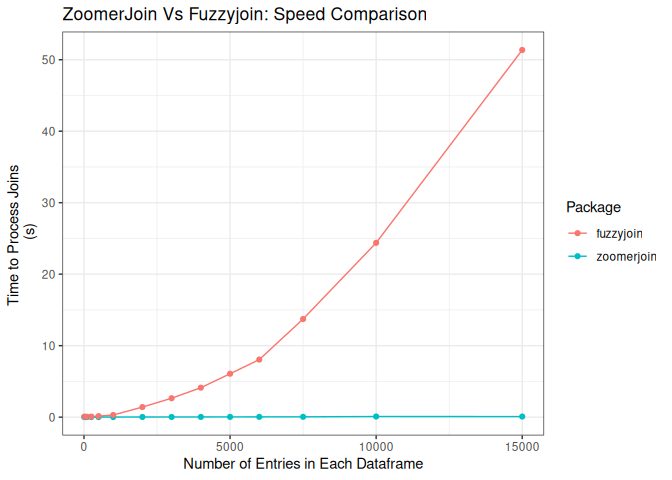

# ZoomerJoin 

INSANELY, BLAZINGLY FAST fuzzy joins in R. Implimented using
[MinHash](https://en.wikipedia.org/wiki/MinHash) to cut down on the
number of comparisons that need to be made in calculating matches. This
results in matches that return orders of magnitude faster than other
matches.

# Installation

## Installing Rust:

You must have [Rust](https://www.rust-lang.org/tools/install) installed
to compile this package. The rust website provides an excellent
installation script that has never caused me any issues.

On Linux, you can install Rust with:

``` sh
curl --proto '=https' --tlsv1.2 -sSf https://sh.rustup.rs | sh
```

On Windows, I use the rust installation wizard, found
[here](https://forge.rust-lang.org/infra/other-installation-methods.html).

## Installing Package from Github:

Once you install Rust, you should be able to install the package with:

``` r
devtools::install_github("beniaminogreen/zoomerjoin")
```

# Usage:

The package provides the following functions, which are designed to be
near to drop-ins for the corresponding dplyr/fuzzyjoin commands:

- `lsh_left_join()`
- `lsh_right_join()`
- `lsh_inner_join()`
- `lsh_full_join()`
- `lsh_anti_join()`

Here’s a snippet showing off how to use the `lhs_left_join()` command:

I start with two corpses I would like to combine, `corpus_1`:

``` r
corpus_1
```

    ## # A tibble: 500,000 × 2
    ##        a field                                                                  
    ##    <dbl> <chr>                                                                  
    ##  1     1 ufwa cope committee                                                    
    ##  2     2 committee to re elect charles e. bennett                               
    ##  3     3 montana democratic party non federal account                           
    ##  4     4 mississippi power & light company management political action and educ…
    ##  5     5 napus pac for postmasters                                              
    ##  6     6 aminoil good government fund                                           
    ##  7     7 national women's political caucus of california                        
    ##  8     8 minnesota gun owners' political victory fund                           
    ##  9     9 metropolitan detroit afl cio cope committee                            
    ## 10    10 carpenters legislative improvement committee united brotherhood of car…
    ## # … with 499,990 more rows

And `corpus_2`:

``` r
corpus_2
```

    ## # A tibble: 500,000 × 2
    ##         b field                               
    ##     <dbl> <chr>                               
    ##  1 832471 avrp studios inc                    
    ##  2 832472 avrd design                         
    ##  3 832473 avenales cattle co                  
    ##  4 832474 auto dealers of michigan political a
    ##  5 832475 atty & counselor at law             
    ##  6 832476 at&t united way                     
    ##  7 832477 ashland food & liquors              
    ##  8 832478 arvance turkey ranch inc            
    ##  9 832479 arizona federation of teachers      
    ## 10 832480 arianas restaurant                  
    ## # … with 499,990 more rows

The two Corpuses can’t be directly joined because of misspellings. This
means we must use the fuzzy-matching capabilities of zoomerjoin:

``` r
start_time <- Sys.time()
join_out <- lsh_inner_join(corpus_1, corpus_2, n_gram_width=6, n_bands=20, band_width=6)
```

    ## Joining by 'field'

``` r
print(Sys.time() - start_time)
```

    ## Time difference of 9.61343 secs

``` r
print(join_out)
```

    ## # A tibble: 2,534 × 4
    ##         a field.x                                                      b field.y
    ##     <dbl> <chr>                                                    <dbl> <chr>  
    ##  1 419899 united electrical radio & machine workers of ameri      898725 united…
    ##  2  83295 national rifle association                              945750 nation…
    ##  3 338301 fidelity abstract & title co                            847969 fideli…
    ##  4  58487 fleming & associates, l.l.p.                            909451 flemin…
    ##  5 145301 hagans bobb & burdine pc                                963059 hagans…
    ##  6  67535 eye pac of the texas opthamological assoc.              881869 eye pa…
    ##  7 223885 transport workers union political contributions cmte    899914 transp…
    ##  8  16702 american federation of state county & municipal employ… 995935 americ…
    ##  9  46968 fayette county republican party                         881765 fayett…
    ## 10  50514 associated general contractors pac of ca                975950 associ…
    ## # … with 2,524 more rows

ZoomerJoin finds and joins on the matching rows in just a few seconds.

## Benchmarks:

Here’s a quick and dirty benchmark showing the performance of this
package relative to another matching package, `fuzzyjoin` which
calculates all pairwise similarities between different records in the
process of matching.

<!-- -->

The difference is stark! While the running time of other matching
packages scales with the product of the rows of the two dataframes
"),
the run time of zoomerjoin scales with the sum of the two
"),
meaning it can be used for large datasets.
