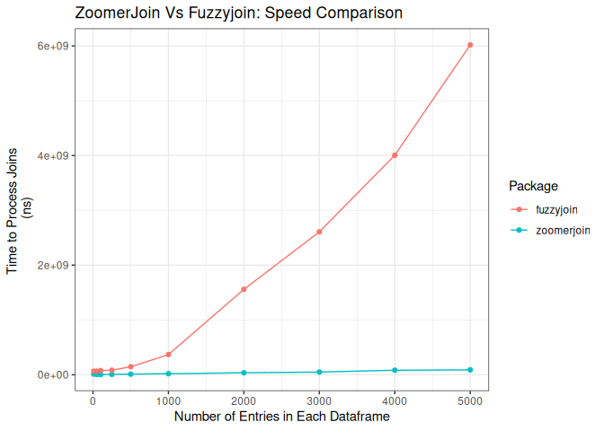

# ZoomerJoin 

INSANELY, BLAZINGLY FAST fuzzy joins in R. Implimented using
[MinHash](https://en.wikipedia.org/wiki/MinHash), such that each record
does not have to be compared to all other records when matching. This
results in matches that return orders of magnitude faster than other
matching packages.

# Installation

## Installing Rust:

You must have [Rust](https://www.rust-lang.org/tools/install) installed
to compile this package. The rust website provides an excellent
installation script that has never caused me any issues.

On Linux, you can install Rust with:

``` sh
curl --proto '=https' --tlsv1.2 -sSf https://sh.rustup.rs | sh
```

On Windows, I use the rust installation wizard, found
[here](https://forge.rust-lang.org/infra/other-installation-methods.html).

## Installing Package from Github:

Once you install rust, you should be able to install the package with:

``` r
devtools::install_github("beniaminogreen/zoomerjoin")
```

# Usage:

The package provides the following functions, which are designed to be
near to drop-ins for the corresponding dplyr/fuzzyjoin commands:

- `lsh_left_join()`
- `lsh_right_join()`
- `lsh_inner_join()`
- `lsh_full_join()`
- `lsh_anti_join()`

Here’s a snippet showing off how to use the `lhs_left_join()` command:

``` r
corpus_1
```

    ## # A tibble: 500,000 × 2
    ##        a field                                                                  
    ##    <dbl> <chr>                                                                  
    ##  1     1 ufwa cope committee                                                    
    ##  2     2 committee to re elect charles e. bennett                               
    ##  3     3 montana democratic party non federal account                           
    ##  4     4 mississippi power & light company management political action and educ…
    ##  5     5 napus pac for postmasters                                              
    ##  6     6 aminoil good government fund                                           
    ##  7     7 national women's political caucus of california                        
    ##  8     8 minnesota gun owners' political victory fund                           
    ##  9     9 metropolitan detroit afl cio cope committee                            
    ## 10    10 carpenters legislative improvement committee united brotherhood of car…
    ## # … with 499,990 more rows

``` r
corpus_2
```

    ## # A tibble: 500,000 × 2
    ##         b field                               
    ##     <dbl> <chr>                               
    ##  1 832471 avrp studios inc                    
    ##  2 832472 avrd design                         
    ##  3 832473 avenales cattle co                  
    ##  4 832474 auto dealers of michigan political a
    ##  5 832475 atty & counselor at law             
    ##  6 832476 at&t united way                     
    ##  7 832477 ashland food & liquors              
    ##  8 832478 arvance turkey ranch inc            
    ##  9 832479 arizona federation of teachers      
    ## 10 832480 arianas restaurant                  
    ## # … with 499,990 more rows

``` r
start_time <- Sys.time()
join_out <- lsh_inner_join(corpus_1, corpus_2, n_gram_width=6, n_bands=20, band_width=5)
```

    ## Joining by 'field'

``` r
print(Sys.time() - start_time)
```

    ## Time difference of 28.84619 secs

``` r
print(join_out)
```

    ## # A tibble: 2,330 × 4
    ##         a field.x                                                      b field.y
    ##     <dbl> <chr>                                                    <dbl> <chr>  
    ##  1  70617 akin gump strauss hauer & feld l.l.p. civic action com… 9.80e5 akin g…
    ##  2  63596 mcginnis lochridge & kilgore,                           1.26e6 mcginn…
    ##  3  53424 american electric power company committee for responsi… 9.96e5 americ…
    ##  4 147637 friends for will hartnett                               8.81e5 friend…
    ##  5  43222 brotherhood of locomotive engineers txpac               8.77e5 brothe…
    ##  6  78531 blue crossblue shield assn                              1.03e6 blue c…
    ##  7  52162 scott douglass & mcconnico llp,                         1.21e6 scott …
    ##  8  46419 roberts markel weinberg pc                              9.15e5 robert…
    ##  9  70717 yetter warden & coleman llp,                            1.11e6 yetter…
    ## 10 310667 sci funeral & cem purchasing co                         1.09e6 sci fu…
    ## # … with 2,320 more rows

## Benchmarks:

Here’s a quick and dirty benchmark showing the performance of this
package realative to the default standard, `fuzzyjoin`:

<!-- -->

## Limiting the Number of Threads:

To constrain the number of cores the program uses, you can set the
`RAYON_NUM_THREADS` variable before running the search. At present, this
variable is read at the construction of the multithreading thread pool,
and so must be set once each R session. In a future version, I’ll work
to include a fix so that the number of threads can be included in an
argument to the `lhs_join` functions.

Here’s an example of how to set the function to run on an single core in
R:

``` r
Sys.setenv(RAYON_NUM_THREADS=1)
```
