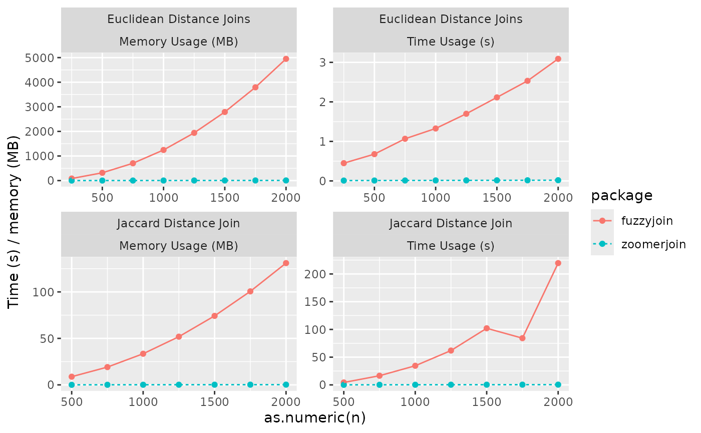

# Benchmarks

### Introduction

In this short vignette, I show off benchmarks of the zoomerjoin package,
comparing it to the excellent
[fuzzyjoin](https://github.com/dgrtwo/fuzzyjoin) package. The two
packages are designed to do different things - the fuzzyjoin package is
*very fast,* and provides more distance functions (as well as other
joining modes) - but it’s a useful comparison as it shows off the time
that can be saved using LSH relative to all pairwise comparisons, as
long as you are okay with using Jaccard similarity.

### Benchmarks

Here, I show the time it takes fuzzyjoin and zoomerjoin to fuzzily join
two datasets as the size of each dataset increases. Fuzzyjoin is
initially quick, but the runtime scales with the square of the input
size. Zoomerjoin is slower for small datasets but is less
memory-intensive, and scales with the sum of the rows in each dataset,
so it becomes quicker for larger datasets.

    #> Rows: 60 Columns: 5
    #> ── Column specification ────────────────────────────────────────────────────────
    #> Delimiter: ","
    #> chr (3): package, join_type, name
    #> dbl (2): n, value
    #> 
    #> ℹ Use `spec()` to retrieve the full column specification for this data.
    #> ℹ Specify the column types or set `show_col_types = FALSE` to quiet this message.



## Benchmarking Code:

Below, I include the code used to generate the benchmarks:

``` r
library(zoomerjoin)
library(fuzzyjoin)
library(tidyverse)
library(microbenchmark)
library(profmem)


# Sample million rows from DIME dataset
data_1 <- as.data.frame(sample_n(dime_data, 10^6))
names(data_1) <- c("id_1", "name")
data_2 <- as.data.frame(sample_n(dime_data, 10^6))
names(data_2) <- c("id_2", "name")

# Generate datasets for euclidean join benchmarking
n <- 10^5
p <- 50
X <- matrix(rnorm(n * p), n, p)
X_1 <- as.data.frame(X)
X_2 <- as.data.frame(X + .000000001)

# Get time and memory use statistics for fuzzyjoin when performing jaccard join
fuzzy_jaccard_bench <- function(n) {
  time <- microbenchmark(
    stringdist_inner_join(data_1[1:n, ],
      data_2[1:n, ],
      method = "jaccard",
      max_dist = .6,
      q = 4
    ),
    times = 10
  )$time %>%
    median()

  mem <- profmem(stringdist_inner_join(data_1[1:n, ],
    data_2[1:n, ],
    method = "jaccard",
    max_dist = .6,
    q = 4
  )) %>%
    total()

  return(c(time = time, memory = mem))
}


# Get time and memory use statistics for zoomerjoin when performing jaccard join
zoomer_jaccard_bench <- function(n) {
  time <- microbenchmark(
    jaccard_inner_join(data_1[1:n, ], data_2[1:n, ],
      by = "name", band_width = 11,
      n_bands = 350, threshold = .7,
      n_gram_width = 4
    ),
    times = 50
  )$time %>%
    median()

  mem <- profmem(
    jaccard_inner_join(data_1[1:n, ], data_2[1:n, ],
      by = "name", band_width = 11,
      n_bands = 350, threshold = .7,
      n_gram_width = 4
    )
  ) %>%
    total()

  return(c(time = time, memory = mem))
}

# Get time and memory use statistics for fuzzyjoin when performing Euclidean join
fuzzy_euclid_bench <- function(n) {
  time <- microbenchmark(
    distance_join(X_1[1:n, ], X_2[1:n, ], max_dist = .1, method = "euclidean"),
    times = 10
  )$time %>%
    median()

  mem <- total(profmem(
    distance_join(X_1[1:n, ], X_2[1:n, ], max_dist = .1, method = "euclidean")
  ))

  return(c(time = time, memory = mem))
}

# Get time and memory use statistics for zoomerjoin when performing Euclidean join
zoomer_euclid_bench <- function(n) {
  time <- microbenchmark(
    euclidean_inner_join(X_1[1:n, ], X_2[1:n, ],
      threshold = .1, n_bands = 90,
      band_width = 2, r = .1
    ),
    times = 50
  )$time %>%
    median()

  mem <- profmem(euclidean_inner_join(X_1[1:n, ], X_2[1:n, ],
    threshold = .1, n_bands = 90,
    band_width = 2, r = .1
  )) %>%
    total()

  return(c(time = time, memory = mem))
}


# Run Grid of Jaccard Benchmarks, Collect results into DF
n <- seq(500, 4000, 250)
names(n) <- n
fuzzy_jacard_benches <- map_df(n, fuzzy_jaccard_bench, .id = "n")
zoomer_jacard_benches <- map_df(n, zoomer_jaccard_bench, .id = "n")
fuzzy_jacard_benches$package <- "fuzzyjoin"
zoomer_jacard_benches$package <- "zoomerjoin"
jaccard_benches <- bind_rows(fuzzy_jacard_benches, zoomer_jacard_benches)
jaccard_benches$join_type <- "Jaccard Distance"

# Run Grid of Euclidean Benchmarks, Collect results into DF
n <- seq(250, 4000, 250)
names(n) <- n
fuzzy_euclid_benches <- map_df(n, fuzzy_euclid_bench, .id = "n")
zoomer_euclid_benches <- map_df(n, zoomer_euclid_bench, .id = "n")
fuzzy_euclid_benches$package <- "fuzzyjoin"
zoomer_euclid_benches$package <- "zoomerjoin"
euclid_benches <- bind_rows(fuzzy_euclid_benches, zoomer_euclid_benches)
euclid_benches$join_type <- "Euclidean Distance"

sim_data <- bind_rows(euclid_benches, jaccard_benches) %>%
  pivot_longer(c(time, memory)) %>%
  mutate(value = ifelse(name == "time", value / 10^9, value / 10^6)) # convert ns to s and bytes to Gb.

write_csv(sim_data, "sim_data.csv")
```
