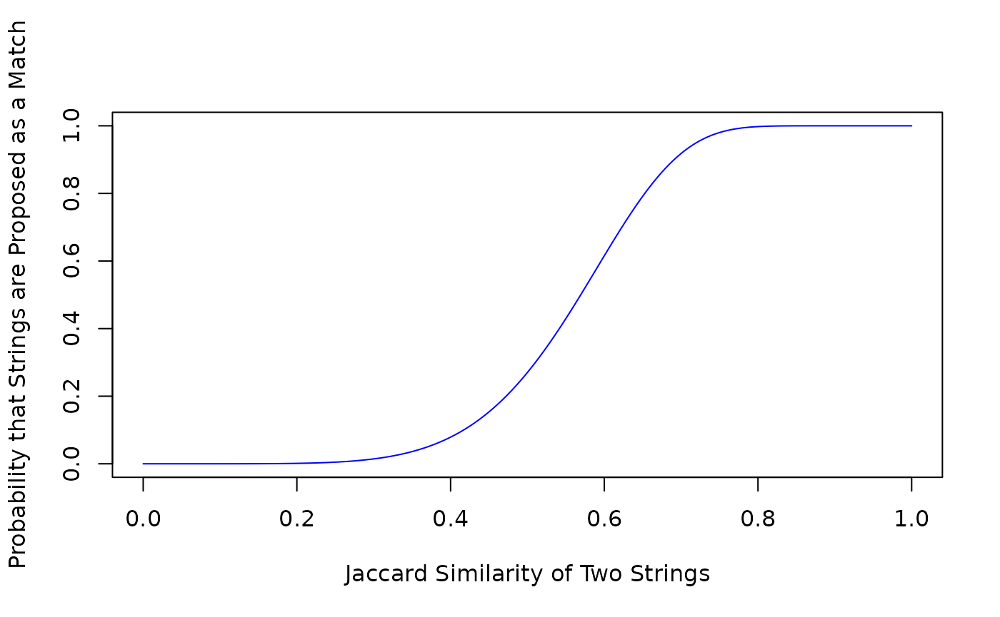

# A Zoomerjoin Guided Tour

### Introduction:

This vignette gives a basic overview of the core functionality of the
zoomerjoin package. Zoomerjoin empowers you to fuzzily-match datasets
with millions of rows in seconds, while staying light on memory usage.
This makes it feasible to perform fuzzy-joins on datasets in the
hundreds of millions of observations in a matter of minutes.

## How Does it Work?

Zoomerjoin’s blazingly fast joins for the string distance are made
possible by an optimized, performant implementation of the
[MinHash](https://en.wikipedia.org/wiki/MinHash) algorithm written in
Rust.

While most conventional joining packages compare the all pairs of
records in the two datasets you wish to join, the MinHash algorithm
manages to compare only similar records to each other. This results in
matches that are orders of magnitudes faster than other matching
software packages: `zoomerjoin` takes hours or minutes to join datasets
that would have taken centuries to join using other matching methods.

## Basic Syntax:

If you’re familiar with the logical-join syntax from `dplyr`, then you
already know how to use fuzzy join to join two datasets. Zoomerjoin
provides
[`jaccard_inner_join()`](https://beniaminogreen.github.io/zoomerjoin/reference/jaccard-joins.md)
and
[`jaccard_full_join()`](https://beniaminogreen.github.io/zoomerjoin/reference/jaccard-joins.md)
(among others), which are the fuzzy-joining analogues of the
corresponding dplyr functions.

I demonstrate the syntax by using the package to join to corpuses, which
formed from entries from the [Database on Ideology, Money in Politics,
and Elections (DIME)](https://data.stanford.edu/dime) (Bonica 2016).

The first corpus looks as follows:

``` r
library(tidyverse)
```

    ## ── Attaching core tidyverse packages ──────────────────────── tidyverse 2.0.0 ──
    ## ✔ dplyr     1.2.0     ✔ readr     2.2.0
    ## ✔ forcats   1.0.1     ✔ stringr   1.6.0
    ## ✔ ggplot2   4.0.2     ✔ tibble    3.3.1
    ## ✔ lubridate 1.9.5     ✔ tidyr     1.3.2
    ## ✔ purrr     1.2.1     
    ## ── Conflicts ────────────────────────────────────────── tidyverse_conflicts() ──
    ## ✖ dplyr::filter() masks stats::filter()
    ## ✖ dplyr::lag()    masks stats::lag()
    ## ℹ Use the conflicted package (<http://conflicted.r-lib.org/>) to force all conflicts to become errors

``` r
library(microbenchmark)
library(zoomerjoin)

corpus_1 <- dime_data %>% # dime data is packaged with zoomerjoin
  head(500)
names(corpus_1) <- c("a", "field")
corpus_1
```

    ## # A tibble: 500 × 2
    ##        a field                                                                  
    ##    <dbl> <chr>                                                                  
    ##  1     1 ufwa cope committee                                                    
    ##  2     2 committee to re elect charles e. bennett                               
    ##  3     3 montana democratic party non federal account                           
    ##  4     4 mississippi power & light company management political action and educ…
    ##  5     5 napus pac for postmasters                                              
    ##  6     6 aminoil good government fund                                           
    ##  7     7 national women's political caucus of california                        
    ##  8     8 minnesota gun owners' political victory fund                           
    ##  9     9 metropolitan detroit afl cio cope committee                            
    ## 10    10 carpenters legislative improvement committee united brotherhood of car…
    ## # ℹ 490 more rows

And the second looks as follows:

``` r
corpus_2 <- dime_data %>% # dime data is packaged with zoomerjoin
  tail(500)
names(corpus_2) <- c("b", "field")
corpus_2
```

    ## # A tibble: 500 × 2
    ##        b field                                                                  
    ##    <dbl> <chr>                                                                  
    ##  1   501 citizens for derwinski                                                 
    ##  2   502 progressive victory fund greater washington americans for democratic a…
    ##  3   503 ingham county democratic party federal campaign fund                   
    ##  4   504 committee for a stronger future                                        
    ##  5   505 atoka country supper committee                                         
    ##  6   506 friends of democracy pac inc                                           
    ##  7   507 baypac                                                                 
    ##  8   508 international brotherhood of electrical workers local union 278 cope/p…
    ##  9   509 louisville & jefferson county republican executive committee           
    ## 10   510 democratic party of virginia                                           
    ## # ℹ 490 more rows

The two Corpuses can’t be directly joined because of misspellings. This
means we must use the fuzzy-matching capabilities of zoomerjoin:

``` r
set.seed(1)
start_time <- Sys.time()
join_out <- jaccard_inner_join(corpus_1, corpus_2,
  by = "field", n_gram_width = 6,
  n_bands = 20, band_width = 6, threshold = .8
)
print(Sys.time() - start_time)
```

    ## Time difference of 0.01268506 secs

``` r
print(join_out)
```

    ## # A tibble: 8 × 4
    ##       a field.x                                                      b field.y  
    ##   <dbl> <chr>                                                    <dbl> <chr>    
    ## 1   230 pipefitters local union 524                                998 pipefitt…
    ## 2   378 guarini for congress 1982                                  883 guarini …
    ## 3   238 4th congressional district democratic party                518 16th con…
    ## 4   319 7th congressional district democratic party of wisconsin   792 8th cong…
    ## 5   292 bill bradley for u s senate '84                            913 bill bra…
    ## 6   302 americans for good government inc                          910 american…
    ## 7    88 scheuer for congress 1980                                  667 scheuer …
    ## 8   378 guarini for congress 1982                                  606 guarini …

The first two arguments, `a`, and `b`, are direct analogues of the
`dplyr` arguments, and are the two data frames you want to join. The
`by` field also acts the same as it does in ‘dplyr’ (it provides the
function the columns you want to match on).

The `n_gram_width` parameter determines how wide the n-grams that are
used in the similarity evaluation should be, while the `threshold`
argument determines how similar a pair of strings has to be (in Jaccard
similarity) to be considered a match. Users of the `stringdist` or
`fuzzyjoin` package will be familiar with both of these arguments, but
should bear in mind that those packages measure *string distance* (where
a distance of 0 indicates complete similarity), while this package
operates on *string similarity,* so a threshold of .8 will keep matches
above 80% Jaccard similarity.

The `n_bands` and `band_width` parameters govern the performance of the
LSH. The default parameters should perform well for medium-size (n \<
10^7) datasets where matches are somewhat similar (similarity \> .8),
but may require tuning in other settings. the
[`jaccard_hyper_grid_search()`](https://beniaminogreen.github.io/zoomerjoin/reference/jaccard_hyper_grid_search.md),
and
[`jaccard_curve()`](https://beniaminogreen.github.io/zoomerjoin/reference/jaccard_curve.md)
functions can help select these parameters for you given the properties
of the LSH you desire.

As an example, you can use the
[`jaccard_curve()`](https://beniaminogreen.github.io/zoomerjoin/reference/jaccard_curve.md)
function to plot the probability that a pair of records are compared at
each possible Jaccard distance, $d$ between zero and one:

``` r
jaccard_curve(20, 6)
```



By looking at the plot produced, we can see that using these
hyperparameters, comparisons will almost never be made between pairs of
records that have a Jaccard similarity of less than .2 (saving time),
pairs of records that have a Jaccard similarity of greater than .8 are
almost always compared (giving a low false-negative rate).

For more details about the hyperparameters, the `textreuse` package has
an excellent vignette, and zoomerjoin provides a re-implementation of
its profiling tools, `jaccard_probability,` and `jaccard_bandwidth`
(although the implementations differ slightly as the hyperparameters in
each package are different).

## Standardizing String Names After A Merge

Often after merging, it can help to standardize the names or fields that
have been joined on. This way, you can assign a unique label or
identifying key to all observations that have a similar value of the
merging variable. The
[`jaccard_string_group()`](https://beniaminogreen.github.io/zoomerjoin/reference/jaccard_string_group.md)
function makes this possible. It first performs locality sensitive
hashing to identify similar pairs of observations within the dataset,
and then runs a community detection algorithm to identify clusters of
similar observations, which are each assigned a label. The
community-detection algorithm, `fastgreedy.community()` from the
`igraph` package runs in log-linear time, so the entire algorithm
completes in linearithmic time.

Here’s a short snippet showing how you can use
[`jaccard_string_group()`](https://beniaminogreen.github.io/zoomerjoin/reference/jaccard_string_group.md)
to standardize a set of organization names.

``` r
organization_names <- c(
  "American Civil Liberties Union",
  "American Civil Liberties Union (ACLU)",
  "NRA National Rifle Association",
  "National Rifle Association NRA",
  "National Rifle Association",
  "Planned Parenthood",
  "Blue Cross"
)
standardized_organization_names <- jaccard_string_group(organization_names, threshold = .5, band_width = 3)
```

    ## Loading required namespace: igraph

``` r
print(standardized_organization_names)
```

    ## [1] "American Civil Liberties Union" "American Civil Liberties Union"
    ## [3] "NRA National Rifle Association" "NRA National Rifle Association"
    ## [5] "NRA National Rifle Association" "Planned Parenthood"            
    ## [7] "Blue Cross"

### References:

Bonica, Adam. 2016. Database on Ideology, Money in Politics, and
Elections: Public version 2.0 \[Computer file\]. Stanford, CA: Stanford
University Libraries.
