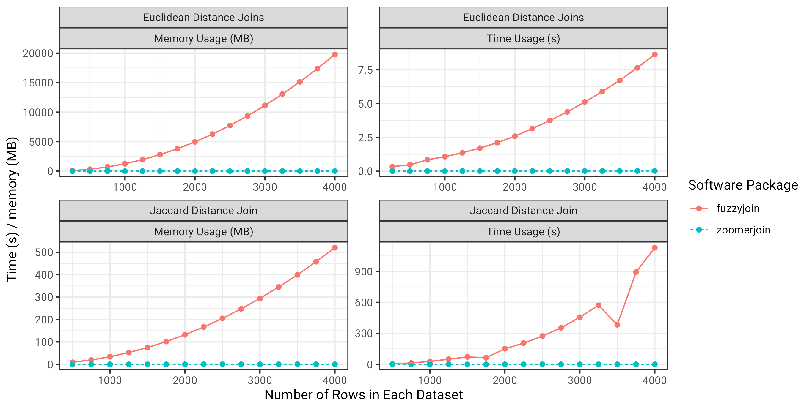

# Summary

Researchers often have to link large datasets without access to a unique
identifying key, or on the basis of a field that contains misspellings, small
errors, or is otherwise inconsistent. In these cases, "fuzzy" matching
techniques are employed, which are resilient to minor corruptions in the fields
meant to identify observations in each dataset. However, most popular methods
involve comparing all possible pairs of matches between each dataset, incurring
a computational cost that scales with the product of the rows in each dataset
$\mathcal{O}(mn)$. As such, these methods do not scale to large datasets.

Zoomerjoin is an R package that empowers users to fuzzily-join massive datasets
in R. It is backed by two performant, mutlithreaded Locality-Sensitive Hash
algorithms [@Broder; @Datar_2004], which minimize comparisons between units
rows that do not match, and typically run in linear, $\mathcal{O(m+n)}$ time.
The algorithmic details are technical but the results are transformational; for
the distance-metrics it supports, `zoomerjoin` takes seconds or minutes to join
datasets that would have taken other matching packages hours or years.

# Statement of Need

Fuzzy matching is typically defined as linking all pairs of observations
between two datasets that have distance less than a specified threshold.
Existing fuzzy-joining methods in R do not scale to large datasets as they make
a comparison between all pairs of rows between two datasets before returning
the matching pairs. More pressingly, the most popular implementations generally
have a space complexity of $O(mn)$, meaning that a patient user cannot simply
wait for the join to complete, as the memory of even large machines will
quickly be exhausted by the algorithm.

Zoomerjoin solves this problem by implementing two Locality-Sensitive Hashing
algorithms [@Broder; @Datar_2004] which sort observations in each dataset into
buckets using a bespoke hash function.  The hashing function assgins similar
entries the same key with high probability, while dissimilar items do not land
in the same bucket with high probability. After this initial sorting step, the
algorithm checks pairs of records in the same bucket to see if they are close
enough to be considered a match. This program then takes $O(\max{m_i n_j})$
time to run (time proportional to the largest Cartesian product observations in
any bucket). In the ordinary case that each observation matches to few
points in another dataset, the running time is dominated by the hashing step,
and the program finishes in linear time using linear memory.

With this remarkable increase in speed comes two costs: Locality-Sensitive
hashes are probabilistic, so there is some probability that some true matches
may be discarded by chance (although the chance that any true matches are
discarded can be made arbitrarily low by changing parameters of the
hash). Additionally, they are complex to implement than exhaustive
searches `zoomerjoin` only hashing schemes for two commonly distances, the
Jaccard distance (for strings and other data that can be represented as a set)
and the Euclidean distance (for vectors or points in space).

The Jaccard similarity is defined over two sets, $\mathcal{A}$ and
$\mathcal{B}$, as the cardinality of their intersection over their union. It
can take values in the inverval [0,1].

$$sim(\mathcal{A},\mathcal{B}) = \frac{|\mathcal{A} \cap \mathcal{B}|}{|\mathcal{A} \cup \mathcal{B}|}$$

Two strings can be compared by transforming them into sets of characters or
sets of consecutive "shingles" of characters, then comparing them using the
Jaccard distance.

The Euclidean distance, defined over two vectors, $\overrightarrow{a}$, and
$\overrightarrow{b}$ is defined as the square root of the sum of squares of
their componentwise distances, and can take values in the interval $[0,
\infty)$:

$$dist(\overrightarrow{a},\overrightarrow{b}) = ||\overrightarrow{a}-\overrightarrow{b}||_2$$

## Implementation Details

Instrumental to the package's fast performance is the relentlessly-optimized,
 `dashmap` Rust crate [@dashmap], which provides a fast hash map
 that can be populated by many threads working in parallel.
 `Dashmap`'s concurrent hash maps are used to quickly store the
 hashes associated with each observation and allow multiple threads
 to compute hashes and write to the hash map at the same time.
 Parallel computation of the hashes is scheduled using the parallel
 iterators provided by the `rayon` crate [@rayon]. The
 Locality-Sensitive Hash implementation for the Jaccard distance is
 modeled after the textbook description by @massive, including the
 technique of storing the hashes of the tokens rather than the
 tokens themselves to save memory.

## Benchmarks

I show how the runtime and memory consumption of the programs scale with the
number of observations in the datasets being joined. I choose to include the
`fuzzyjoin` package as a point of comparison as its superlative tidy syntax and
fast underlying implementation backed by the multithreaded `stringdist` package
[@stringdist] make it the de-facto standard for fuzzy-matching in R.

I compare both packages' time and memory usage joining two datasets using the
Jaccard distance for strings and the Euclidean distance for points.

For the Jaccard distance benchmarks, I use both R packages to join rows of
donor names from the Database on Ideology, Money in Politics, and Elections
(DIME) [@DIME], a database of donors to interest groups, a dataset used to
benchmark other matching / joining algorithms [@Kaufman_2021]. For the
Euclidean distance, I use the programs to link datasets of points drawn from a
multivatiate gaussian with 50 dimensions to a copy of this dataset with dataset
with each observation shifted by a small $\varepsilon = .00001$ upwards along
each axis.

Zoomerjoin achieves almost linear scaling in both runtime and memory, while
`fuzzyjoin` scales quadratically in both quantities. Even for datasets with
2500 rows, `zoomerjoin` finishes in under a second. By contrast, the
Jaccard-distance joins implemented in `fuzzyjoin` take over three minutes to
join. For the largest Euclidean datasets, `fuzzyjoin` almost exhausts the 8GB
memory capacity of the laptop used for benchmarking, while `zoomerjoin`'s
memory is never above 8 MB (a thousandfold decrease).

## State of the Field:

To the best of my knowledge, no other packages exist for fuzzy-joining in
sub-quadratic time in R. Two similar packages are the aforementioned
`fuzzyjoin,` which provides fast, tidy joins for small to medium datasets, and
the `textreuse` package [@textreuse] which implements Locality-Sensitive
Hashing, but does not offer a joining functionality implemented mostly in R.

Zoomerjoin is heavily inspired by both packages, and aims to synthesize and
extend aspects of both to create a powerful joining toolset. The package
combines the functionality of the tidy, dplyr-style `fuzzyjoin`s provided by
`fuzzyjoin` with the performance offered by the same Locality-Sensitive Hashing
algorithm used in `textreuse`. The core of the package is written in performant
Rust code, which makes the package suitable for datasets with hundreds of
millions of observations.

## Other Functionalities

The flagship feature of `zoomerjoin` is its fast, dplyr-style joins, but it
also implements two other algorithms improved by locality-sensitive
hashing: a fuzzy-string grouping function which is backed by locality-sensitive
hashing, and an implementation the probabilistic record-linkage algorithm for
the Fellegi-Sunter model [@Fellegi_1969] developed by @Enamorado_2018.

A fuzzy-string-grouping algorithm provides a principled way to correct
misspellings in administrative datasets by combining similar pairs of strings
into groups. The probabilistic record-linkage algorithm described by
@Enamorado_2018 provides a way to link entities between two datasets but
involves comparing all possible pairs between each datasets. A simple
pre-processing step with the Locality-Sensitive Hashing methods of `zoomerjoin`
can drastically decrease the runtime by acting as a data-adaptive-blocking
strategy, limiting comparisons pairs to units that have similar values of a
blocking field.

## Limitations and Future Work

Zoomerjoin currently provides locality-sensitive hashing implementations for
two distances: the Jaccard and the Euclidean distance.  While these distance
metrics are suitable for many if not most applications, researchers may wish to
use other metrics, or bespoke combinations of distance metrics. Further work
could extend the functionality of the package to also support LSH-backed joins
based on other notions of distance such as the edit distance [@Marais_2019] for
strings, or the Manhattan distance for points.

# References :

